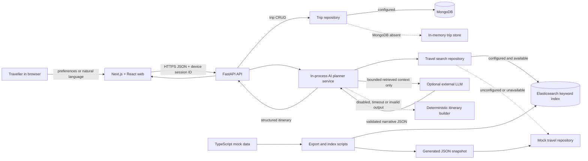

# Visit Jamaica AI Trip Planner

An Nx monorepo for a Next.js/React travel experience and a FastAPI application. It preserves the original editable planner while adding a conversational, retrieval-grounded itinerary path. FastAPI is the only API framework.

## Current architecture

```text
apps/web/                 Next.js 16 and React 19 frontend
apps/api/                 Python 3.11+ FastAPI, MongoDB adapters and Fly.io config
apps/web-e2e/             Playwright browser tests
services/ai-planner/      In-process Python retrieval and itinerary service
mock-data/                Typed repository-managed prototype content and index scripts
libs/catalog/             Legacy sample catalogue retained for the original planner
```

The web app owns presentation and browser-only demo persistence. FastAPI owns request validation, orchestration, CRUD and privacy-filtered analytics. The AI planner is a library in the API process—not a separately deployed microservice. Repository protocols separate planning logic from mock and Elasticsearch implementations.



Elasticsearch uses conventional text, keyword and numeric fields for destination, category, location, tag, popularity and rating queries. There are no embeddings or vector stores.

## Application onboarding

Prerequisites:

- Node.js 20.19 or newer and npm 11 (the repository pins `npm@11.16.0`).
- Python 3.11 or newer and [uv](https://docs.astral.sh/uv/).
- Optional: MongoDB and an Elasticsearch Basic/free-tier-compatible deployment for connected mode.

From the monorepo root:

```bash
npm install
uv sync --project apps/api --dev
cp .env.example .env
cp apps/web/.env.example apps/web/.env.local
npm run mock-data:validate
npm run mock-data:export
npm run seed
npm run dev
```

Open:

- Web: `http://localhost:3000`
- Conversational planner: `http://localhost:3000/ai-planner`
- FastAPI: `http://127.0.0.1:4000`
- OpenAPI docs in development: `http://127.0.0.1:4000/docs`
- Liveness: `http://127.0.0.1:4000/health/live`
- Readiness: `http://127.0.0.1:4000/health/ready`

Run projects independently with `npm run dev:web` and `npm run dev:api`. The web process still needs the API for connected behavior; its existing structured planner can build a browser fallback if the API is offline.

The committed `.env.example` contains placeholders only. Keep MongoDB, Elasticsearch, admin and LLM secrets in the uncommitted root `.env`. Only the public API origin belongs in `apps/web/.env.local`; never expose service keys through a `NEXT_PUBLIC_*` variable.

### Mock data and Elasticsearch

`mock-data/src/*.ts` is the source of truth for the conversational planner. After editing it, validate and regenerate the committed runtime snapshot:

```bash
npm run mock-data:validate
npm run mock-data:export
```

To populate the travel index, fill the Elasticsearch placeholders in `.env`, then run:

```bash
npm run search:index
```

This creates or refreshes `ELASTICSEARCH_TRAVEL_INDEX` (default `visit-jamaica-travel`). The existing structured planner keeps its compatibility catalogue and protected `/api/search/reindex` path.

### Demo and fallback behavior

- No `MONGODB_URI`: trip CRUD uses process memory, while the browser keeps its existing local fallback.
- No `ELASTICSEARCH_URL`, an unavailable index, or a failed query: the AI planner reads the generated mock-data snapshot.
- `AI_ENABLED=false`, no gateway key, a timeout, or invalid model JSON: retrieved records are arranged deterministically.
- All visible records are sample data. Availability, accessibility, ratings and prices must be checked with a provider.

### Validation commands

```bash
npm run lint
npm run typecheck
npm test
npm run test:e2e
npm run build
npm run graph
npx nx run api:docker-build
```

### Common setup failures

- `uv: command not found`: install uv, then rerun `uv sync --project apps/api --dev`.
- Python import or dependency errors: rerun the same `uv sync` command; use Nx/npm scripts from the repository root so `PYTHONPATH` is set.
- Port 3000 or 4000 already in use: stop the conflicting process before `npm run dev`.
- Elasticsearch indexing fails: confirm `.env` exists, the URL is reachable, and exactly one supported credential method is set.
- Planner shows fallback mode: this is expected without optional services; check API logs and `/health/ready` before enabling connected mode.
- Playwright lacks a browser: run `npx playwright install chromium`, then retry `npm run test:e2e`.

## First-use product journey

The structured journey at `/plan` collects timing, party, destination, interests, pace, spend and practical needs. It ranks approved sample content, generates an editable outline, and lets the visitor replace, remove or reorder ideas before saving to MongoDB or the browser.

The conversational journey at `/ai-planner` accepts a plain-language request. FastAPI interprets it, retrieves repository records through Elasticsearch or the mock fallback, gives the optional LLM only that bounded context, validates the response and renders a day timeline, destination/activity cards and a budget notice. The visitor can favourite the interpreted destination and save the itinerary locally.

## API additions

- `POST /api/ai-planner` — validate a natural-language request and return a grounded structured itinerary.
- `GET /api/travel-search` — search mock/Elasticsearch travel records by query, destination, type, tag and price level.
- Existing `/api/plan`, `/api/trips`, `/api/search`, `/api/search/reindex`, `/api/events` and health routes remain compatible.

Analytics events are allowlisted and property-filtered. The implementation tracks search, destination views, planner requests, generated/saved itineraries and favourites without sending the natural-language request. The event boundary can later be adapted to Snowplow without changing UI calls.

## Architecture assessment and recommendations

The current Nx boundaries and single deployable API are appropriate for prototype speed. Keeping AI planning in an in-process service avoids premature microservices. FastAPI and Pydantic provide a clear validation boundary; React is correctly limited to the frontend rather than used as a backend framework.

MongoDB remains practical for device-scoped itinerary documents and event intake. The broader travel domain is relational: destinations, regions, venues, reviews, users and preferences have many-to-many relationships and integrity constraints. PostgreSQL is the stronger long-term system of record. Do not migrate during prototype validation; first stabilize domain identifiers and repository contracts, then introduce PostgreSQL adapters behind them. A future CMS should publish through the same repository/indexing boundary.

## Roadmap

1. **Prototype (implemented):** repository mock data, keyword Elasticsearch retrieval, optional bounded LLM generation, deterministic fallback and lightweight analytics.
2. **Content platform:** CMS editorial workflow, PostgreSQL system of record and reliable Elasticsearch synchronization.
3. **Advanced search:** only after measured need, evaluate embeddings and hybrid retrieval alongside keyword search.
4. **Agent platform:** only after governance and observability mature, separate profile, recommendation, planning and validation responsibilities.

## Technical risks and scalability

- Mock records can drift from the generated JSON; CI should run validation/export and fail on an uncommitted diff.
- The in-memory rate limiter and fallback trip store are per process; production needs shared enforcement and durable identity before horizontal scaling.
- Device UUIDs scope data but are not authentication. Add verified identity before storing sensitive or long-lived traveller data.
- Elasticsearch and model output can change ranking or wording. Preserve source IDs, schema validation, timeouts and deterministic fallbacks.
- Local browser saves are intentionally limited and not cross-device. Promote conversational itineraries into the existing trip repository after the product contract is settled.
- The checked-in dataset is small. Before adding caches, streams or services, measure index size, query latency, API throughput and LLM cost.

Deployment and operational details remain in [connected-mode setup](docs/CONNECTED_MODE.md), [stack and cost controls](docs/STACK_AND_COSTS.md), [content operations](docs/CONTENT_OPERATIONS.md), and [maintenance and releases](docs/MAINTENANCE_AND_RELEASES.md).
