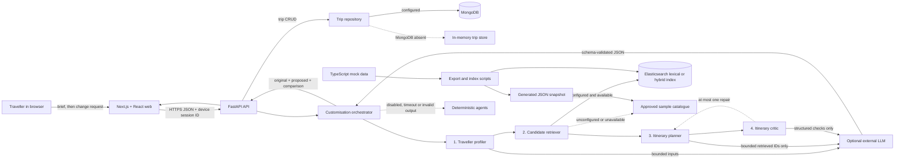

# Visit Jamaica AI Trip Planner

An Nx monorepo for a Next.js/React travel experience and a FastAPI application. AI is used to customise an itinerary only after the traveller has completed their first trip plan. FastAPI is the only API framework.

## Current architecture

```text
apps/web/                 Next.js 16 and React 19 frontend
apps/api/                 Python 3.11+ FastAPI, MongoDB adapters and Fly.io config
apps/web-e2e/             Playwright browser tests
services/ai-planner/      In-process Python customisation agents and legacy retrieval service
mock-data/                Typed repository-managed prototype content and index scripts
libs/catalog/             Legacy sample catalogue retained for the original planner
```

The web app owns presentation, explicit Apply/Return decisions and browser-only demo persistence. FastAPI owns request validation, sequential agent orchestration, CRUD and privacy-filtered analytics. The agents are a library in the API process—not separately deployed microservices. Repository protocols separate planning logic from deterministic, model and Elasticsearch adapters.



Elasticsearch always supports the lexical path used by this prototype. When `ELASTICSEARCH_SEMANTIC_FIELD` names a compatible `semantic_text` field, retrieval combines lexical and semantic matches with reciprocal-rank fusion. If that capability is absent or fails, hybrid/live mode uses the deterministic approved-catalogue fallback instead of dead-ending the journey. No separate vector database is used.

## Application onboarding

Prerequisites:

- Node.js 20.19 or newer and npm 11 (the repository pins `npm@11.16.0`).
- Python 3.11 or newer and [uv](https://docs.astral.sh/uv/).
- Optional: MongoDB and an Elasticsearch Basic/free-tier-compatible deployment for connected mode.

From the monorepo root:

```bash
npm install
uv sync --project apps/api --dev
cp .env.example .env
cp apps/web/.env.example apps/web/.env.local
npm run mock-data:validate
npm run mock-data:export
npm run seed
npm run dev
```

Open:

- Web: `http://localhost:3000`
- Trip customiser: create a plan first, then follow its **Customise this trip** action to `/ai-planner?tripId=…`
- FastAPI: `http://127.0.0.1:4000`
- OpenAPI docs in development: `http://127.0.0.1:4000/docs`
- Liveness: `http://127.0.0.1:4000/health/live`
- Readiness: `http://127.0.0.1:4000/health/ready`

Run projects independently with `npm run dev:web` and `npm run dev:api`. The web process still needs the API for connected behavior; its existing structured planner can build a browser fallback if the API is offline.

The committed `.env.example` contains placeholders only. Keep MongoDB, Elasticsearch, admin and LLM secrets in the uncommitted root `.env`. Only the public API origin belongs in `apps/web/.env.local`; never expose service keys through a `NEXT_PUBLIC_*` variable.

### Mock data and Elasticsearch

`libs/catalog/seed/items.json` is the approved sample source used by first-trip planning and customisation. `mock-data/src/*.ts` remains the source for the legacy travel-search endpoint. After editing mock travel data, validate and regenerate its committed runtime snapshot:

```bash
npm run mock-data:validate
npm run mock-data:export
```

To populate the travel index, fill the Elasticsearch placeholders in `.env`, then run:

```bash
npm run search:index
```

This creates or refreshes `ELASTICSEARCH_TRAVEL_INDEX` (default `visit-jamaica-travel`). Trip customisation queries `ELASTICSEARCH_INDEX` (default `visit-jamaica-content`), populated through the protected `/api/search/reindex` path. Adding `ELASTICSEARCH_SEMANTIC_FIELD` to a new index mapping requires recreating/reindexing that index; leave it empty for lexical search when the deployment does not support `semantic_text`.

### Customisation modes

- `AGENT_MODE=demo` (default): all four agents run deterministically against approved sample records. The three built-in demo requests are family friendly, relaxed/reduced travel, and more food/culture. Adding “invalid” exercises the single repair pass.
- `AGENT_MODE=live`: model-backed profiling/planning/critique and Elasticsearch retrieval are attempted; any unavailable or invalid step falls back to its deterministic adapter and is labelled `live-fallback`.
- `AGENT_MODE=hybrid`: connected steps are used where available and deterministic adapters fill gaps; results are labelled `hybrid-live` or `hybrid-fallback`.

For live/hybrid mode, set `AI_ENABLED=true`, `AI_GATEWAY_API_KEY`, `ELASTICSEARCH_URL`, and supported Elastic credentials. Set `ELASTICSEARCH_SEMANTIC_FIELD` only when that mapped field exists. `AGENT_TIMEOUT_MS` bounds the complete chain; `AGENT_DIAGNOSTICS` enables coarse diagnostics but never permits raw change requests in analytics.

### Demo and fallback behavior

- No `MONGODB_URI`: trip CRUD uses process memory, while the browser keeps its existing local fallback.
- No `ELASTICSEARCH_URL`, an unavailable index, or a failed query: trip customisation retrieves from the approved catalogue deterministically.
- `AI_ENABLED=false`, no gateway key, a timeout, or invalid model JSON: the relevant customisation agent uses its deterministic adapter.
- All visible records are sample data. Availability, accessibility, ratings and prices must be checked with a provider.

### Validation commands

```bash
npm run lint
npm run typecheck
npm test
npm run test:e2e
npm run build
npm run graph
npx nx run api:docker-build
```

### Common setup failures

- `uv: command not found`: install uv, then rerun `uv sync --project apps/api --dev`.
- Python import or dependency errors: rerun the same `uv sync` command; use Nx/npm scripts from the repository root so `PYTHONPATH` is set.
- Port 3000 or 4000 already in use: stop the conflicting process before `npm run dev`.
- Elasticsearch indexing fails: confirm `.env` exists, the URL is reachable, and exactly one supported credential method is set.
- Planner shows fallback mode: this is expected without optional services; check API logs and `/health/ready` before enabling connected mode.
- Playwright lacks a browser: run `npx playwright install chromium`, then retry `npm run test:e2e`.

## First-use product journey

The structured journey at `/plan` collects timing, party, destination, interests, pace, spend and practical needs. It ranks approved sample content, generates an editable outline, and then offers **Keep this trip** or **Customise this trip**. There is intentionally no AI-planner link in primary navigation.

The customisation route requires a current trip. It summarises that trip and asks “What would you like to change?” FastAPI runs Profiler → Retriever → Planner → Critic in order, with at most one repair. The UI compares added, removed and moved items. The original remains untouched until **Apply changes**; the traveller can retry or return to the original. Browser/Mongo persistence is reused after Apply. Flights are explicitly outside scope.

## API additions

- `POST /api/trips/{trip_id}/customise` — return a grounded draft, comparison and critic result without mutating the saved trip.
- `POST /api/ai-planner` — legacy grounded itinerary endpoint retained for compatibility; it is no longer a primary-navigation journey.
- `GET /api/travel-search` — search mock/Elasticsearch travel records by query, destination, type, tag and price level.
- Existing `/api/plan`, `/api/trips`, `/api/search`, `/api/search/reindex`, `/api/events` and health routes remain compatible.

Analytics events are allowlisted and property-filtered. Customisation records only offered/started/generated/applied/abandoned/fallback signals plus coarse mode, count, outcome and time bands. Raw change text, inferred profile values, accessibility choices and itinerary contents are never sent.

## Architecture assessment and recommendations

The current Nx boundaries and single deployable API are appropriate for prototype speed. Keeping AI planning in an in-process service avoids premature microservices. FastAPI and Pydantic provide a clear validation boundary; React is correctly limited to the frontend rather than used as a backend framework.

MongoDB remains practical for device-scoped itinerary documents and event intake. The broader travel domain is relational: destinations, regions, venues, reviews, users and preferences have many-to-many relationships and integrity constraints. PostgreSQL is the stronger long-term system of record. Do not migrate during prototype validation; first stabilize domain identifiers and repository contracts, then introduce PostgreSQL adapters behind them. A future CMS should publish through the same repository/indexing boundary.

## Roadmap

1. **Prototype (implemented):** first-trip customisation, four typed agents, optional lexical/hybrid Elasticsearch retrieval, bounded model calls, deterministic fallback and privacy-safe analytics.
2. **Content platform:** CMS editorial workflow, PostgreSQL system of record and reliable Elasticsearch synchronization.
3. **Search evaluation:** measure lexical versus `semantic_text` hybrid relevance, latency and free-tier resource use before expanding semantic infrastructure.
4. **Agent operations:** add governed tracing and evaluation before considering separately deployed agent services.

## Technical risks and scalability

- Opening hours, duration, transition and accessibility metadata added by the customisation adapter are clearly labelled prototype assumptions. Replace them with provider/CMS records before production; most sample records do not yet include coordinates.
- Hybrid retrieval assumes a compatible Elastic deployment and a separately mapped `semantic_text` field containing title, summary and interests. Lexical search and deterministic retrieval remain the safe defaults when semantic inference is unsupported.
- Live model use still requires a real Vercel AI Gateway key; connected MongoDB and Elasticsearch use real deployment credentials that are intentionally absent from this repository.
- Mock records can drift from the generated JSON; CI should run validation/export and fail on an uncommitted diff.
- The in-memory rate limiter and fallback trip store are per process; production needs shared enforcement and durable identity before horizontal scaling.
- Device UUIDs scope data but are not authentication. Add verified identity before storing sensitive or long-lived traveller data.
- Elasticsearch and model output can change ranking or wording. Preserve source IDs, schema validation, timeouts, critic checks and deterministic fallbacks.
- Local browser saves are intentionally limited and not cross-device. Promote conversational itineraries into the existing trip repository after the product contract is settled.
- The checked-in dataset is small. Before adding caches, streams or services, measure index size, query latency, API throughput and LLM cost.

Deployment and operational details remain in [connected-mode setup](docs/CONNECTED_MODE.md), [stack and cost controls](docs/STACK_AND_COSTS.md), [content operations](docs/CONTENT_OPERATIONS.md), and [maintenance and releases](docs/MAINTENANCE_AND_RELEASES.md).
